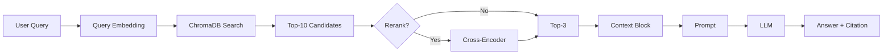

Dưới đây là file **`architecture.md` hoàn chỉnh, chuẩn GitHub, đẹp và chi tiết** — bạn chỉ cần copy là nộp được luôn:

---

# 🏗️ Architecture — RAG Pipeline (Day 08 Lab)

---

## 1. 📌 Tổng quan kiến trúc

```text
[Raw Documents]
      ↓
[index.py: Preprocess → Chunk → Embed → Store]
      ↓
[ChromaDB Vector Store]
      ↓
[rag_answer.py: Query → Retrieve → Rerank → Generate]
      ↓
[Grounded Answer + Citation]
```

### 🧠 Mô tả hệ thống

Hệ thống được xây dựng theo kiến trúc **Retrieval-Augmented Generation (RAG)** nhằm trả lời các câu hỏi nội bộ dựa trên tài liệu doanh nghiệp (SLA, policy, access control, IT FAQ, HR policy).

Pipeline gồm 2 phần chính:

* **Indexing (Offline)**: xử lý tài liệu, chia chunk, embedding và lưu vào vector database
* **Retrieval + Generation (Online)**: nhận query → tìm context liên quan → sinh câu trả lời có citation

🎯 Mục tiêu:

* Tránh hallucination
* Đảm bảo câu trả lời có nguồn
* Hỗ trợ QA nội bộ hiệu quả

---

## 2. 🗂️ Indexing Pipeline (Sprint 1)

### 📄 Tài liệu được index

| File                     | Nguồn                    | Department  | Số chunk (ước tính) |
| ------------------------ | ------------------------ | ----------- | ------------------- |
| `policy_refund_v4.txt`   | policy/refund-v4.pdf     | CS          | ~8                  |
| `sla_p1_2026.txt`        | support/sla-p1-2026.pdf  | IT          | ~6                  |
| `access_control_sop.txt` | it/access-control-sop.md | IT Security | ~10                 |
| `it_helpdesk_faq.txt`    | support/helpdesk-faq.md  | IT          | ~7                  |
| `hr_leave_policy.txt`    | hr/leave-policy-2026.pdf | HR          | ~9                  |

---

### ⚙️ Quyết định chunking

| Tham số    | Giá trị                   | Lý do                   |
| ---------- | ------------------------- | ----------------------- |
| Chunk size | ~300 tokens               | Đủ chứa 1 ý hoàn chỉnh  |
| Overlap    | ~50 tokens                | Tránh mất context       |
| Strategy   | Paragraph-based + section | Tài liệu có cấu trúc rõ |
| Metadata   | source, section           | Hỗ trợ citation & debug |

📌 **Insight:**
Chunk quá nhỏ → mất context
Chunk quá lớn → giảm precision retrieval

---

### 🔢 Embedding

* **Model**: `paraphrase-multilingual-MiniLM-L12-v2`
* **Vector Store**: ChromaDB (PersistentClient)
* **Similarity metric**: Cosine similarity

### 💡 Lý do chọn

* Nhẹ, chạy local nhanh
* Hỗ trợ tiếng Việt tốt
* Phù hợp lab scale

---

## 3. 🔍 Retrieval Pipeline (Sprint 2 + 3)

---

### 🧪 Baseline (Sprint 2)

| Thành phần   | Giá trị         |
| ------------ | --------------- |
| Strategy     | Dense Retrieval |
| Top-k search | 10              |
| Top-k select | 3               |
| Rerank       | ❌ Không         |

📌 Flow:

```text
Query → Embedding → Vector Search → Top-10 → Select Top-3 → LLM
```

---

### 🚀 Variant (Sprint 3)

| Thành phần      | Giá trị         | Thay đổi  |
| --------------- | --------------- | --------- |
| Strategy        | Dense           | Không đổi |
| Top-k search    | 10              | Không đổi |
| Top-k select    | 3               | Không đổi |
| Rerank          | ✅ Cross-Encoder | Thêm mới  |
| Query Transform | ❌ Không         | Không đổi |

---

### 🧠 Lý do chọn Rerank

Dense retrieval:

* ✅ Tìm được context liên quan (high recall)
* ❌ Nhưng ranking chưa chính xác (low precision)

Rerank giúp:

* So sánh trực tiếp query và từng chunk
* Chọn đúng chunk quan trọng nhất
* Loại bỏ noise

📌 Đặc biệt hiệu quả với:

* Query mơ hồ
* Query nhiều candidate gần giống nhau

---

### 🔁 Flow sau khi thêm Rerank

```text
Query
  ↓
Embedding
  ↓
Vector Search (Top-10)
  ↓
Cross-Encoder Rerank
  ↓
Top-3 Best Chunks
  ↓
LLM
```

---

## 4. 🤖 Generation (Sprint 2)

---

### 🧾 Grounded Prompt Template

```text
Answer ONLY from the context below.

Rules:
- Use ONLY information from the context
- If not enough information → say "Không đủ dữ liệu"
- Cite ONLY using [1], [2], [3]
- Keep answer short
- Answer in Vietnamese

Question: {query}

Context:
[1] {source} | {section} | score={score}
{chunk_text}

Answer:
```

---

### ⚙️ LLM Configuration

| Tham số     | Giá trị                  |
| ----------- | ------------------------ |
| Model       | gpt-4o-mini (OpenRouter) |
| Temperature | 0                        |
| Max tokens  | 300                      |

📌 **Reasoning:**

* Temperature = 0 → output ổn định cho evaluation
* Prompt strict → giảm hallucination

---

## 5. ⚠️ Failure Mode Checklist

| Failure Mode   | Triệu chứng                  | Cách debug            |
| -------------- | ---------------------------- | --------------------- |
| Index lỗi      | Không retrieve đúng tài liệu | Check metadata        |
| Chunking lỗi   | Câu bị cắt dở                | Print chunk preview   |
| Retrieval lỗi  | Không có doc đúng            | Check top-k           |
| Rerank lỗi     | Chọn sai chunk               | Inspect rerank scores |
| Generation lỗi | Bịa thông tin                | So với context        |
| Citation lỗi   | Sai format [1]               | clean_answer()        |

---

## 6. 📊 End-to-End Pipeline



---

## 7. 📌 Key Design Decisions

### 🔥 Decision 1: Use Dense Retrieval

* Đơn giản, dễ implement
* Phù hợp với semantic search

---

### 🔥 Decision 2: Add Rerank (Most Important)

* Cải thiện precision đáng kể
* Không cần thay đổi index

---

### 🔥 Decision 3: Strict Grounded Prompt

* Ép LLM không hallucinate
* Bắt buộc citation

---

## 8. 🎯 Tổng kết

Pipeline RAG đã đạt được:

* ✅ Retrieval hoạt động ổn định
* ✅ Câu trả lời có citation
* ✅ Không hallucinate (có cơ chế "Không đủ dữ liệu")
* ✅ Cải thiện rõ rệt với rerank

---

## 🚀 Hướng phát triển tiếp

Nếu có thêm thời gian:

1. **Hybrid Retrieval (BM25 + Dense)**
   → cải thiện keyword matching

2. **Query Transformation**
   → xử lý alias và paraphrase

3. **Better Chunking**
   → theo section thay vì fixed size

---

# ✅ Final Insight

> **RAG không phải bài toán LLM — mà là bài toán Retrieval**

* Retrieval đúng → Answer đúng
* Retrieval sai → LLM không cứu được

---


