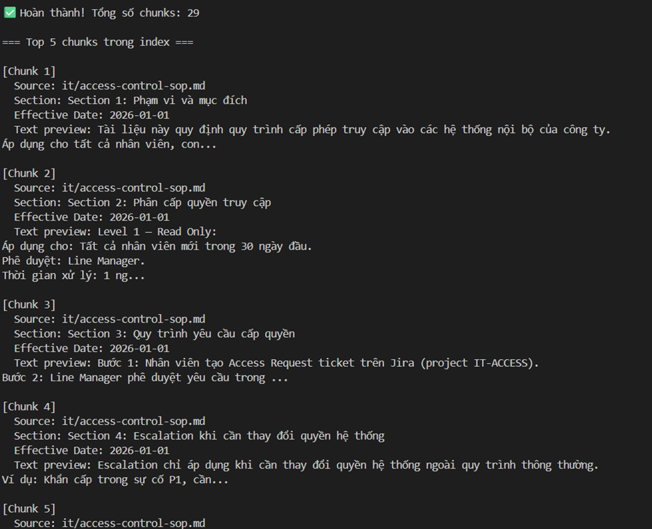
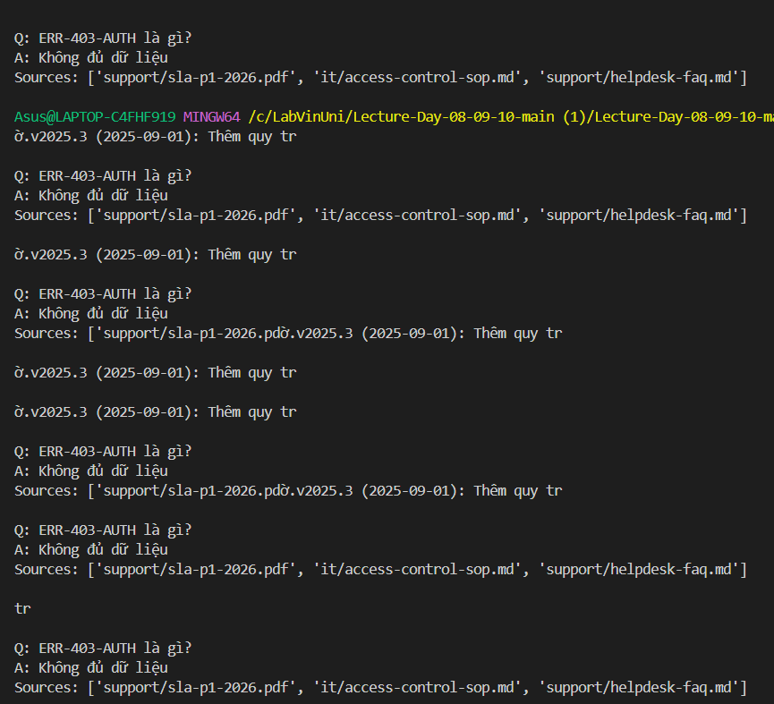

# Báo Cáo Cá Nhân — Lab Day 08: RAG Pipeline

**Họ và tên:** Nguyễn Tiến Đạt  
**Vai trò trong nhóm:** Solo (Tech Lead + Retrieval + Evaluation + Documentation)  
**Ngày nộp:** 13/04/2026  

---

## 1. Tôi đã làm gì trong lab này?

Trong lab này, tôi thực hiện toàn bộ pipeline RAG một cách độc lập, bao gồm cả Sprint 2 (baseline RAG) và Sprint 3 (tuning và evaluation). 

Ở Sprint 2, tôi xây dựng pipeline cơ bản gồm các bước: embedding → retrieval → generation. Cụ thể, tôi implement hàm `retrieve_dense()` để truy vấn dữ liệu từ ChromaDB bằng embedding model `paraphrase-multilingual-MiniLM-L12-v2`. Sau đó, tôi xây dựng hàm `rag_answer()` để kết nối toàn bộ pipeline, bao gồm việc chọn top-k chunks, xây dựng context block và tạo prompt ép model trả lời có citation.

Ở Sprint 3, tôi quyết định sử dụng phương pháp **rerank bằng cross-encoder** thay vì hybrid retrieval. Tôi tích hợp model `cross-encoder/ms-marco-MiniLM-L-6-v2` để chấm lại độ liên quan giữa query và các candidate chunks, từ đó chọn ra top-3 chunks tốt nhất trước khi đưa vào LLM.

Ngoài ra, tôi cũng xử lý nhiều vấn đề thực tế như:
- Chuẩn hóa citation bằng regex (`clean_answer()`)
- Giảm hallucination bằng grounded prompt
- Debug lỗi retrieval không đúng context

Pipeline của tôi là một hệ thống end-to-end hoàn chỉnh từ truy vấn đến câu trả lời có nguồn.

---

## 2. Điều tôi hiểu rõ hơn sau lab này

Sau khi hoàn thành lab, tôi hiểu sâu hơn về vai trò của từng thành phần trong hệ thống RAG, đặc biệt là **retrieval**.

Trước đây, tôi nghĩ rằng chất lượng của hệ thống phụ thuộc chủ yếu vào LLM. Tuy nhiên, qua thực nghiệm, tôi nhận ra rằng nếu retrieval không tốt thì LLM dù mạnh cũng không thể trả lời đúng. Điều này thể hiện rõ ở các câu hỏi như "ERR-403-AUTH", khi hệ thống không tìm được context phù hợp thì kết quả bắt buộc phải là "Không đủ dữ liệu".

Tôi cũng hiểu rõ hơn về **reranking**. Dense retrieval sử dụng embedding có thể tìm được các đoạn văn "gần nghĩa", nhưng không đảm bảo chính xác tuyệt đối. Cross-encoder rerank giúp đánh giá trực tiếp từng cặp (query, document), nên cho kết quả chính xác hơn ở top-k cuối cùng.

Ngoài ra, tôi học được cách thiết kế **grounded prompt** để kiểm soát output của LLM. Việc ép model chỉ được sử dụng context và bắt buộc citation giúp giảm đáng kể hallucination và tăng độ tin cậy của hệ thống.

---

## 3. Điều tôi ngạc nhiên hoặc gặp khó khăn

Khó khăn lớn nhất trong quá trình làm lab là vấn đề **format citation không ổn định**. Dù prompt đã yêu cầu rõ ràng, model vẫn thường trả về các dạng như:
- `[1†L2]`
- `【1】`
- hoặc chỉ là `1` không có dấu ngoặc

Ban đầu, tôi nghĩ có thể giải quyết hoàn toàn bằng prompt engineering, nhưng thực tế không hiệu quả. Cuối cùng, tôi phải kết hợp cả prompt và post-processing bằng regex trong hàm `clean_answer()` để normalize toàn bộ về dạng `[1]`.

Một vấn đề khác là **retrieval không hoạt động tốt với keyword đặc biệt**, ví dụ như "ERR-403-AUTH". Embedding model không capture tốt các token dạng mã lỗi, dẫn đến việc không retrieve được chunk liên quan. Điều này khiến hệ thống trả về "Không đủ dữ liệu" dù thông tin có thể tồn tại trong corpus.

Ngoài ra, tôi cũng gặp khó khăn trong việc cân bằng giữa:
- top_k_search (recall)
- top_k_select (precision)

Nếu lấy quá ít thì miss context, nhưng nếu lấy quá nhiều thì LLM bị nhiễu.

---

## 4. Phân tích một câu hỏi trong scorecard

**Câu hỏi:** ERR-403-AUTH là lỗi gì?

**Phân tích:**

Ở baseline (dense retrieval), hệ thống không retrieve được chunk chứa thông tin liên quan đến lỗi này. Nguyên nhân chính là embedding không xử lý tốt các keyword dạng mã lỗi như "ERR-403-AUTH".

Khi bật rerank, kết quả vẫn không cải thiện đáng kể. Lý do là rerank chỉ hoạt động tốt khi trong candidate ban đầu có ít nhất một chunk đúng. Trong trường hợp này, toàn bộ candidate đều không liên quan, nên rerank không thể "cứu" được kết quả.

Như vậy, lỗi nằm hoàn toàn ở bước retrieval, không phải generation. LLM đã làm đúng khi trả về "Không đủ dữ liệu" theo rule của grounded prompt.

Điều này cho thấy một insight quan trọng:  
> Rerank chỉ cải thiện precision, nhưng không cải thiện recall.

Nếu muốn xử lý tốt câu hỏi này, cần dùng **hybrid retrieval (dense + BM25)** để bắt được keyword chính xác.

---

## 5. Nếu có thêm thời gian, tôi sẽ làm gì?

Nếu có thêm thời gian, tôi sẽ implement **hybrid retrieval (kết hợp dense và BM25)**. Điều này đặc biệt hữu ích cho các query chứa keyword như mã lỗi, tên riêng hoặc thuật ngữ kỹ thuật.

Ngoài ra, tôi cũng muốn thử **query transformation (query expansion)** để tự động tạo các biến thể của câu hỏi. Điều này có thể cải thiện recall khi query không match trực tiếp với wording trong document.

Cuối cùng, tôi sẽ xây dựng một **evaluation pipeline tự động** để đo accuracy và so sánh các variant một cách định lượng thay vì chỉ quan sát thủ công.

ảnh kết quả sprint

